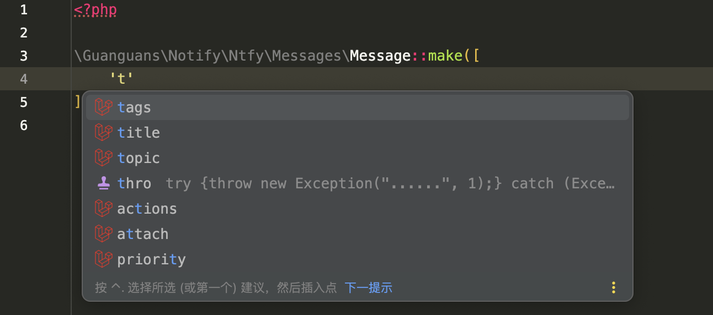

# notify

> [!NOTE]
> Push notification SDK(AnPush、Bark、Chanify、DingTalk、Discord、Gitter、GoogleChat、IGot、Lark、Mattermost、MicrosoftTeams、NowPush、Ntfy、Push、Pushback、PushBullet、PushDeer、Pushover、PushPlus、QQ、RocketChat、ServerChan、ShowdocPush、SimplePush、Slack、Telegram、WeWork、WPush、XiZhi、YiFengChuanHua、Zulip).

[](https://github.com/guanguans/notify/actions/workflows/tests.yml)
[](https://github.com/guanguans/notify/actions/workflows/php-cs-fixer.yml)
[](https://codecov.io/gh/guanguans/notify)
[](https://packagist.org/packages/guanguans/notify)
[](https://github.com/guanguans/notify/releases)
[](https://packagist.org/packages/guanguans/notify)
[](https://packagist.org/packages/guanguans/notify)

## Platform support

[//]: # (https://github.com/dschep/ntfy)
[//]: # (https://github.com/nikoksr/notify)

* [AnPush](./src/AnPush/README.md)
* [Bark](./src/Bark/README.md)
* [Chanify](./src/Chanify/README.md)
* [DingTalk](./src/DingTalk/README.md)
* [Discord](./src/Discord/README.md)
* [~~Gitter~~](./src/Gitter/README.md)
* [GoogleChat](./src/GoogleChat/README.md)
* [IGot](./src/IGot/README.md)
* [Lark](./src/Lark/README.md)
* [Mattermost](./src/Mattermost/README.md)
* [MicrosoftTeams](./src/MicrosoftTeams/README.md)
* [~~NowPush~~](./src/NowPush/README.md)
* [Ntfy](./src/Ntfy/README.md)
* [Push](./src/Push/README.md)
* [Pushback](./src/Pushback/README.md)
* [PushBullet](./src/PushBullet/README.md)
* [PushDeer](./src/PushDeer/README.md)
* [Pushover](./src/Pushover/README.md)
* [PushPlus](./src/PushPlus/README.md)
* [QQ](./src/QQ/README.md)
* [RocketChat](./src/RocketChat/README.md)
* [ServerChan](./src/ServerChan/README.md)
* [ShowdocPush](./src/ShowdocPush/README.md)
* [SimplePush](./src/SimplePush/README.md)
* [Slack](./src/Slack/README.md)
* [Telegram](./src/Telegram/README.md)
* [WeWork](./src/WeWork/README.md)
* [WPush](./src/WPush/README.md)
* [XiZhi](./src/XiZhi/README.md)
* [YiFengChuanHua](./src/YiFengChuanHua/README.md)
* [Zulip](./src/Zulip/README.md)

## Related repository

* [https://github.com/guanguans/laravel-exception-notify](https://github.com/guanguans/laravel-exception-notify)
* [https://github.com/guanguans/yii-log-target](https://github.com/guanguans/yii-log-target)

## Requirement

* PHP >= 7.4

## Installation

```bash
composer require guanguans/notify -v
```

## Usage example

### Quick start

```php
$response = (new Guanguans\Notify\DingTalk\Client(
        new Guanguans\Notify\DingTalk\Authenticator('c44fec1ddaa8a833156efb77b7865d62ae13775418030d94d05da08bfca73')
    ))
    ->send(
        Guanguans\Notify\DingTalk\Messages\BtnsActionCardMessage::make([
            'title' => 'This is title(keyword).',
            'text' => 'This is text.',
        ])
    )
    // ->dump()
    ->json();
```

```php
// 1. Create authenticator
$authenticator = new Guanguans\Notify\DingTalk\Authenticator(
    'c44fec1ddaa8a833156efb77b7865d62ae13775418030d94d05da08bfca73',
    // 'SECc32bb7345c0f73da2b9786f0f7dd5083bd768a29b82e6d460149d730eee51'
);

// 2. Create client
$client = new Guanguans\Notify\DingTalk\Client($authenticator);

// 3. Create message
$message = Guanguans\Notify\DingTalk\Messages\BtnsActionCardMessage::make([
    'title' => 'This is title(keyword).',
    'text' => 'This is text.',
    // 'btnOrientation' => 1,
    // 'btns' => [
    //     [
    //         'title' => 'This is title 1.',
    //         'actionURL' => 'https://github.com/guanguans/notify',
    //     ],
    // ],
])
    ->btnOrientation(1)
    ->addBtn([
        'title' => 'This is title 2.',
        'actionURL' => 'https://github.com/guanguans/notify',
    ]);

// 4. Send message
$response = $client
    // ->baseUri('base-uri')
    // ->connectTimeout(10)
    // ->debug(true)
    // ->proxy('http://127.0.0.1:1087')
    // ->timeout(30)
    // ->verify(false)
    // ->push(
    //     GuzzleHttp\Middleware::log(
    //         new Psr\Log\NullLogger,
    //         new GuzzleHttp\MessageFormatter(GuzzleHttp\MessageFormatter::DEBUG)
    //     ),
    //     'log'
    // )
    // ->before(
    //     'log',
    //     GuzzleHttp\Middleware::mapRequest(
    //         static fn (Psr\Http\Message\RequestInterface $request) => $request
    //     ),
    // )
    ->send($message)
    ->dump()
    // ->throw()
    ->json();
```

### Asynchronous requests

```php
$promise = $client->sendAsync($message);
$response = $promise->wait();
```

### Concurrent requests

```php
/** @var iterable<array-key, \Guanguans\Notify\Foundation\Contracts\Message> $messages */
/** @var array<array-key, \Guanguans\Notify\Foundation\Response|\Psr\Http\Message\ResponseInterface> $responses */
$responses = $client->pool($messages);
```

### Hyperf integration

```php
use Guanguans\Notify\Foundation\Client;
use GuzzleHttp\HandlerStack;
use Hyperf\Guzzle\CoroutineHandler;
use Hyperf\Guzzle\HandlerStackFactory;
use Hyperf\Guzzle\PoolHandler;

// Set Handler directly
// $client->setHandler(make(CoroutineHandler::class));
// $client->setHandler(make(PoolHandler::class));
$client->setHandler((fn () => $this->getHandler($this->option))->call(new HandlerStackFactory));

// Or set HandlerStackResolver
$client->setHandlerStackResolver(static fn (Client $client): HandlerStack => array_reduce(
    $client->defaultMiddlewares(),
    static fn (HandlerStack $handlerStack, callable $middleware) => tap($handlerStack)->push($middleware),
    (new HandlerStackFactory)->create()
));
```

### Completion

> [!TIP]
> Required to install [Laravel Idea](https://plugins.jetbrains.com/plugin/13441-laravel-idea) plugin.



## Testing

```bash
composer test
```

## Benchmark

```bash
composer benchmark
```

```shell
+---------------------+--------------------------+-----+-------+-----+----------+-----------+--------+
| benchmark           | subject                  | set | revs  | its | mem_peak | mode      | rstdev |
+---------------------+--------------------------+-----+-------+-----+----------+-----------+--------+
| SendMessageBench    | benchSendMessage         |     | 10000 | 3   | 9.345mb  | 186.142μs | ±0.05% |
| CreateInstanceBench | benchCreateAuthenticator |     | 10000 | 3   | 6.970mb  | 0.775μs   | ±0.44% |
| CreateInstanceBench | benchCreateMessage       |     | 10000 | 3   | 6.970mb  | 1.776μs   | ±0.56% |
| CreateInstanceBench | benchCreateClient        |     | 10000 | 3   | 7.410mb  | 12.889μs  | ±0.58% |
+---------------------+--------------------------+-----+-------+-----+----------+-----------+--------+
```

## Changelog

Please see [CHANGELOG](CHANGELOG.md) for more information on what has changed recently.

## Contributing

Please see [CONTRIBUTING](.github/CONTRIBUTING.md) for details.

## Security Vulnerabilities

Please review [our security policy](../../security/policy) on how to report security vulnerabilities.

## Credits

* [guanguans](https://github.com/guanguans)
* [All Contributors](../../contributors)

## Thanks

[](https://www.jetbrains.com/?from=https://github.com/guanguans)

## License

The MIT License (MIT). Please see [License File](LICENSE) for more information.
